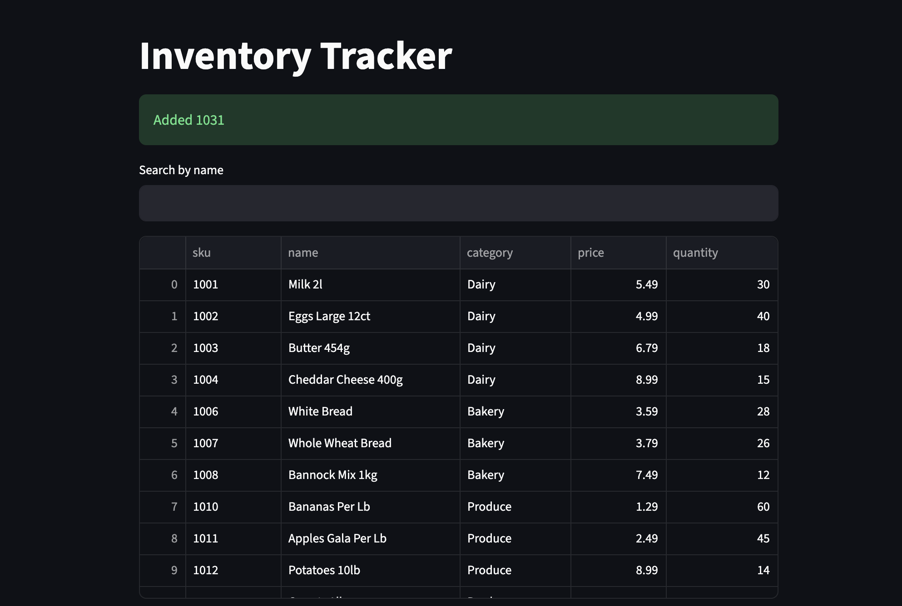
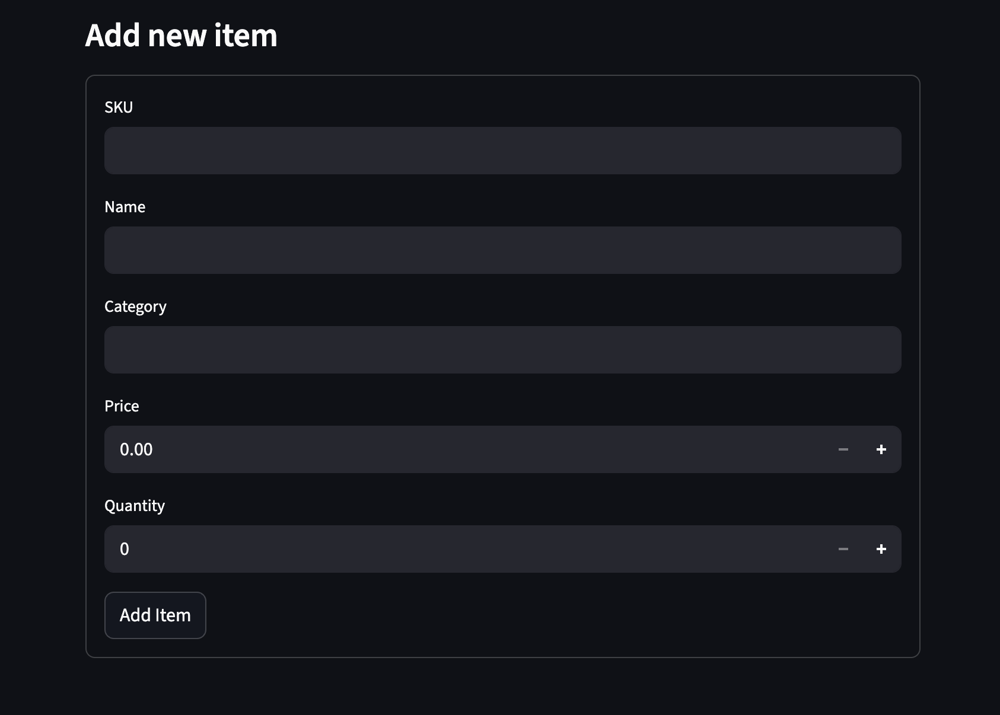

# inventory-tracker

A Python app that modernizes a legacy spreadsheet-based inventory process.
It cleans a messy csv export, loads it into a SQLite database, and provides a web UI to search, review and updates stock.

## Features
- Import and clean a messy CSV (incosistent casting, $ signs, blanks, duplicates)
- Summary report of rows cleaned, rejected with reasons, and duplicates
- Search item by name (case-insensitive)
- Low-stock review and adjustable cutoff that defines Low-stock
- Update quantities so as to replicate receiving stock
- Add new items to the table 

## Tech Stack
Python, SQLite, Streamlit, Pandas

## How to run
- git clone https://github/Kev214/inventory-tracker.git
- cd inventory-tracker
- python -m venv venv
- source venv/bin/activate
- pip install -r requirements.txt
- python3 importer.py
- streamlit run app.py

## Data cleaning rules
- Duplicate SKU - keep the last row
- Blank price - reject and log
- Blank quantity - default to 0
- Negative quantity - reject and log
- Blank sku - reject and log

## Design notes
- db.py - database layer
- importer.py - cleaning 
- app.py - UI

